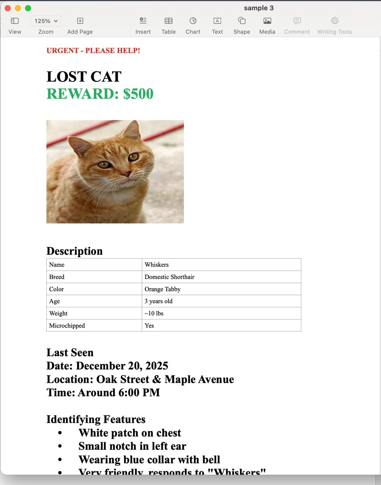

# tinydocx

Minimal DOCX/ODT creation library. **<1K LOC, zero dependencies.**

```
npm install tinydocx
```

---

## Why tinydocx?

|  | tinydocx | docx |
| --- | --- | --- |
| **Size (gzip)** | 7.7 KB | 108.6 KB |
| **Dependencies** | 0 | 5 |

**~14x smaller.** Everything you need: text, tables, lists, images, links, headers/footers.

### Features

| Feature | Description |
| --- | --- |
| **Text** | Any size, bold/italic/underline, hex colors, custom fonts |
| **Paragraphs** | Alignment (left/center/right) |
| **Headings** | H1–H6 |
| **Lists** | Bullet and numbered |
| **Tables** | With borders and column widths |
| **Hyperlinks** | External links |
| **Images** | PNG, JPEG, GIF |
| **Headers/Footers** | With page numbers |
| **Markdown** | Convert to DOCX/ODT |
| **ODT** | OpenDocument support |

---

## Quick start

```typescript
import { docx } from 'tinydocx'
import { writeFileSync } from 'fs'

const doc = docx()
doc.content((ctx) => {
  ctx.heading('Hello World', 1)
  ctx.paragraph('This is a paragraph.')
  ctx.paragraph('Bold text', { bold: true })
  ctx.paragraph('Centered', { align: 'center' })
})

writeFileSync('output.docx', doc.build())
```

### ODT

```typescript
import { odt } from 'tinydocx'

const doc = odt()
doc.content((ctx) => {
  ctx.heading('Hello World', 1)
  ctx.paragraph('Same API, different format.')
})

writeFileSync('output.odt', doc.build())
```

---

## API

```typescript
import { docx, odt, markdownToDocx, markdownToOdt } from 'tinydocx'

const doc = docx()

doc.content((ctx) => {
  ctx.heading(str, level)
  ctx.paragraph(str, opts?)
  ctx.text(str, size, opts?)
  ctx.lineBreak()
  ctx.horizontalRule()
  ctx.list(items, ordered?)
  ctx.table(rows, opts?)
  ctx.link(text, url, opts?)
  ctx.image(data, opts)
  ctx.pageNumber()
})

doc.header((ctx) => { ... })
doc.footer((ctx) => { ... })

doc.build()
```

### TextOptions

```typescript
{
  align?: 'left' | 'center' | 'right'
  bold?: boolean
  italic?: boolean
  underline?: boolean
  color?: string
  font?: string
  size?: number
}
```

### Lists

```typescript
ctx.list(['Item 1', 'Item 2', 'Item 3'])
ctx.list(['First', 'Second', 'Third'], true)
```

### Tables

```typescript
ctx.table([
  ['Name', 'Age'],
  ['Alice', '30'],
  ['Bob', '25']
])

ctx.table([['Wide', 'Narrow']], { colWidths: [4000, 2000] })
```

### Images

```typescript
const imageData = readFileSync('photo.png')
ctx.image(imageData, { width: 4, height: 3 })
```

### Hyperlinks

```typescript
ctx.link('Click here', 'https://example.com')
ctx.link('Styled', 'https://example.com', { bold: true })
```

### Headers/Footers

```typescript
doc.header((ctx) => ctx.paragraph('Company', { bold: true }))
doc.footer((ctx) => ctx.pageNumber())
```

### Markdown

```typescript
import { markdownToDocx, markdownToOdt } from 'tinydocx'

const md = `
# Heading 1
## Heading 2

This is **bold**, *italic*, ~~strikethrough~~, and \`inline code\`.

- Bullet list
  - Nested item
- Another item

1. Numbered list
2. Second item

> Blockquote with **formatting**

| Name | Age |
|------|-----|
| Alice | 30 |

\`\`\`javascript
const code = 'block'
\`\`\`

[Link text](https://example.com)

---
`

writeFileSync('output.docx', markdownToDocx(md))
writeFileSync('output.odt', markdownToOdt(md))
```

**Supported syntax:**

| Feature | Syntax |
|---------|--------|
| Headings | `# ## ### #### ##### ######` |
| Bold | `**text**` or `__text__` |
| Italic | `*text*` or `_text_` |
| Strikethrough | `~~text~~` |
| Inline code | `` `code` `` |
| Links | `[text](url)` |
| Images | `` |
| Bullet lists | `- item` or `* item` |
| Numbered lists | `1. item` |
| Nested lists | Indent with spaces |
| Tables | `\| col \| col \|` |
| Code blocks | ` ``` ` |
| Blockquotes | `> text` |
| Horizontal rule | `---` or `***` or `___` |

---



---

## Full example

```typescript
import { docx } from 'tinydocx'

const doc = docx()

doc.header((ctx) => ctx.paragraph('ACME CORP', { bold: true }))
doc.footer((ctx) => ctx.pageNumber())

doc.content((ctx) => {
  ctx.heading('INVOICE', 1)
  ctx.text('#INV-2025-001', 10, { color: '#666666' })
  ctx.lineBreak()

  ctx.table([
    ['Description', 'Amount'],
    ['Website Development', '$5,000.00'],
    ['Hosting (Annual)', '$200.00']
  ], { colWidths: [6000, 3000] })
  ctx.lineBreak()

  ctx.paragraph('Total: $5,200.00', { bold: true, align: 'right' })
  ctx.link('View online', 'https://example.com/invoice')
})

writeFileSync('invoice.docx', doc.build())
```

---

## How it works

DOCX files are ZIP archives with XML:

```
[Content_Types].xml
_rels/.rels
word/document.xml
word/styles.xml
word/numbering.xml
word/header1.xml
word/footer1.xml
word/media/
```

ODT files:

```
mimetype
META-INF/manifest.xml
content.xml
styles.xml
```

---

## License

MIT
